# Active Directory Home Lab

## Overview

Built a Windows enterprise home lab in Oracle VirtualBox to practice Active Directory administration, Windows Server, networking, PowerShell, Group Policy, file permissions, redundancy, and troubleshooting.

The lab is set up like a small business environment with centralized user and computer management, DHCP-based client networking, department file access, security policies, and redundant domain services.

## Network Architecture

```text
                         AD-Lab Network
                         10.10.10.0/24
                               |
                         10.10.10.1
                      VirtualBox Gateway
                               |
        +----------------------+----------------------+
        |                      |                      |
      DC01                   DC02                 CLIENT01
Windows Server 2025    Windows Server 2025      Windows 11 Pro
   10.10.10.10            10.10.10.11          DHCP Client
        |                      |                      |
   +----+----+            +----+----+                 |
   |    |    |            |    |    |                 |
 AD DS DNS  DHCP        AD DS DNS  DHCP          Domain Joined
   |    |    |            |    |    |            COBO\arivera
   |    |    |            |    |    |
   |    +----+------------+----+    |
   |         DNS Redundancy         |
   |                                |
   +---------- AD Replication ------+
        |                      |
        +------ DHCP Failover -+

DC01 also hosts:
- Group Policy
- SMB File Share
- PowerShell Automation

CLIENT01 DNS Servers:
10.10.10.10, 10.10.10.11
```

## Lab Environment

- Hypervisor: Oracle VirtualBox
- Server OS: Windows Server 2025
- Client OS: Windows 11 Pro
- Domain: `cobo.test`
- Domain Controller 1: `DC01` - `10.10.10.10`
- Domain Controller 2: `DC02` - `10.10.10.11`
- Client Workstation: `CLIENT01` - DHCP assigned
- Network: `10.10.10.0/24`
- Default Gateway: `10.10.10.1`
- DHCP Address Pool: `10.10.10.100 - 10.10.10.200`
- Client DNS Servers: `10.10.10.10`, `10.10.10.11`

## Technologies and Skills

- AD DS
- Active Directory replication
- Domain controller failover testing
- DNS administration and redundancy
- DNS forward and reverse lookup
- DHCP
- DHCP failover in 50/50 Load Balance mode
- GPO administration and troubleshooting
- PowerShell automation
- Windows Server 2025
- Windows 11 Pro
- SMB file sharing
- NTFS permissions
- Security groups and AGDLP permissions
- Account lockout policy administration
- Windows network and domain troubleshooting

## Active Directory Configuration

Created the `cobo.test` domain and promoted `DC01` as the first domain controller.

I built an OU structure to keep users and computers organized by department and device type.

Departments include:

- Accounting
- Human Resources
- IT
- Management
- Sales

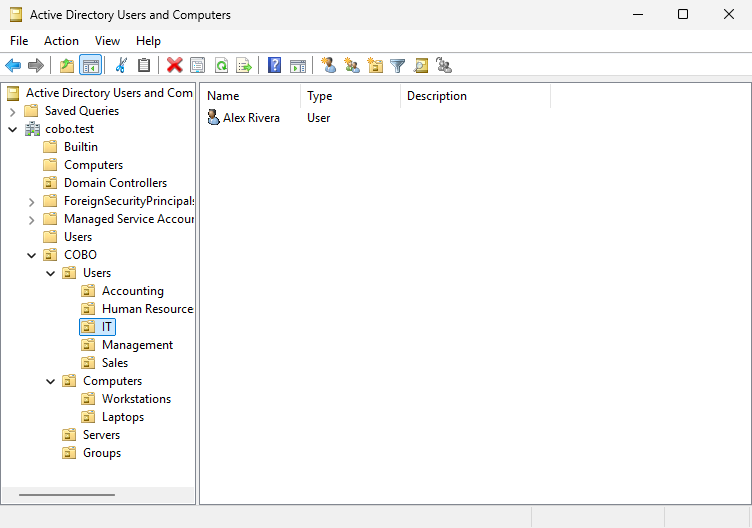

## Users and Security Groups

Created domain users and departmental security groups, then used AGDLP for group-based access control.

`Accounts → Global Groups → Domain Local Groups → Permissions`

Example:

`Alex Rivera → GG_IT_Users → DL_IT_Share_RW → IT Shared Folder`

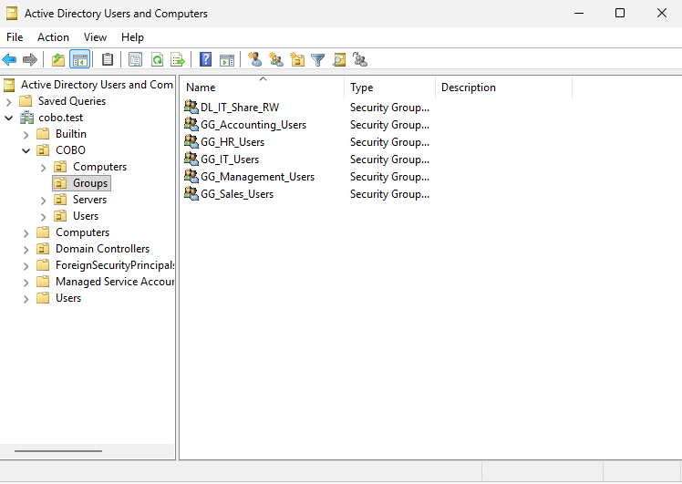

## File Sharing and Permissions

Created an IT department SMB share at:

`\\DC01\IT`

NTFS permissions give IT users Modify access through security-group membership instead of assigning permissions directly to individual users.

I verified access from CLIENT01 while signed in as `COBO\arivera`.

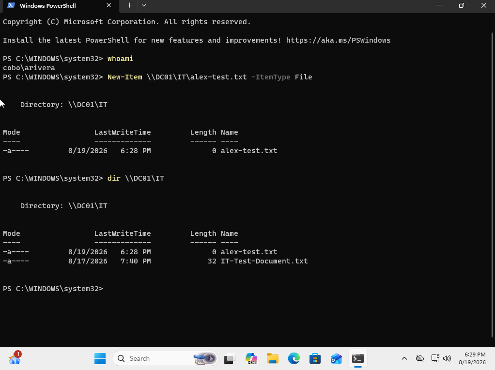

## Domain-Joined Workstation

Installed Windows 11 Pro on CLIENT01 and joined it to the `cobo.test` domain.

Before joining the domain, I pointed the workstation to the domain DNS server and verified Active Directory service discovery. After the join, I moved CLIENT01 into the Workstations OU for centralized management.

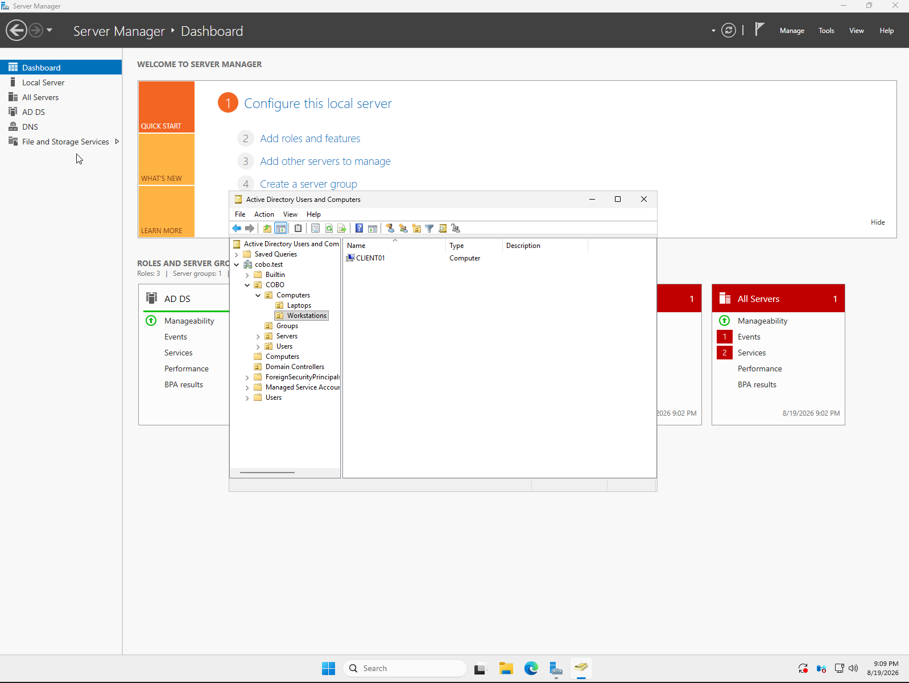

## Group Policy

Created GPOs for workstation security and user configuration.

### Workstation Security Baseline

Configured an inactivity timeout and checked policy application with:

- `gpupdate`
- `gpresult`
- Windows Registry queries

### IT Drive Mapping

Created a user GPO that maps:

`I: → \\DC01\IT`

for users in the IT OU.

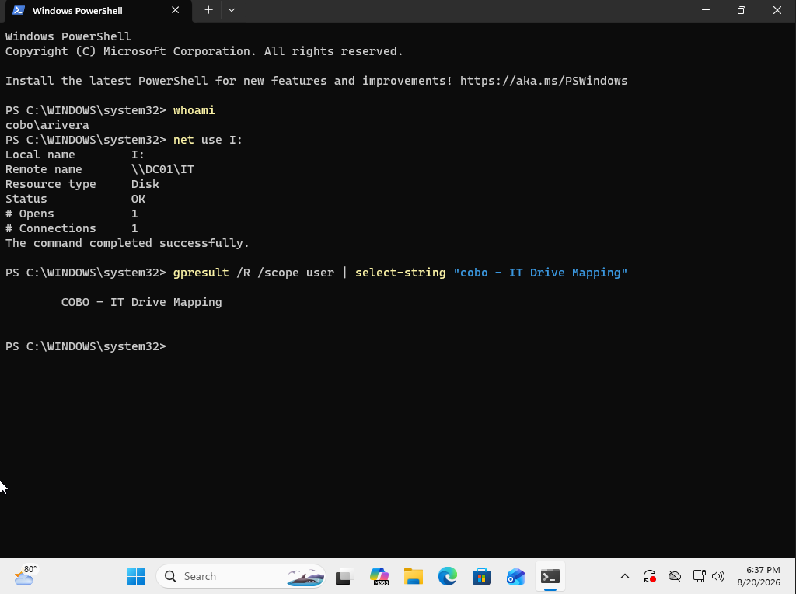

## DHCP Configuration

Installed DHCP on DC01 and created the client address pool:

`10.10.10.100 - 10.10.10.200`

The scope provides clients with:

- IPv4 address
- Subnet mask
- Default gateway
- DNS servers
- DNS domain

CLIENT01 received `10.10.10.100` from DC01.

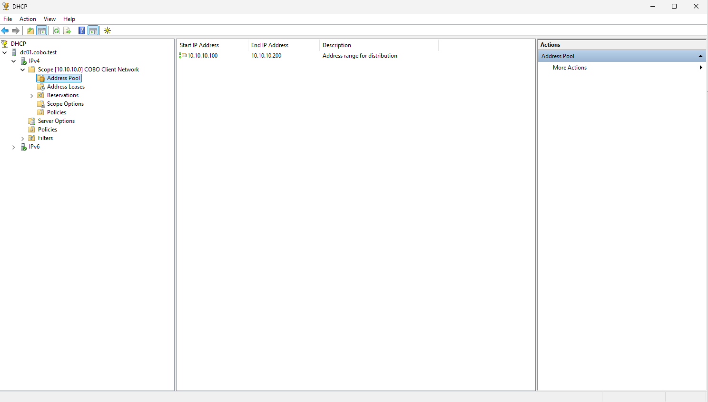

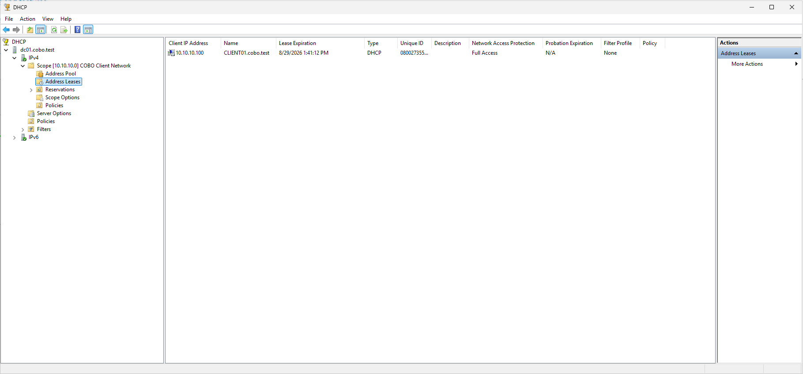

## Domain Controller Redundancy

The lab originally depended on DC01 for AD DS, DNS, and DHCP. I added `DC02` so the environment would not rely on a single domain controller.

DC02 provides a second copy of Active Directory and DNS and later became the DHCP failover partner for DC01.

### DC02 Network Configuration

DC02 uses the following static network settings:

- Hostname: `DC02`
- IPv4 Address: `10.10.10.11`
- Subnet Mask: `255.255.255.0`
- Default Gateway: `10.10.10.1`
- Domain: `cobo.test`

I joined DC02 to the domain as a member server before promoting it.

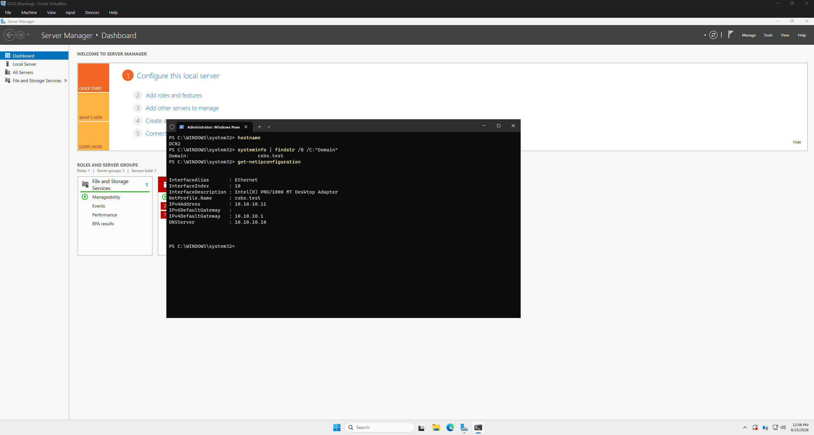

### DC02 Domain Controller Promotion

Installed AD DS and promoted DC02 as an additional domain controller for `cobo.test`.

DC02 was configured as:

- Writable domain controller
- DNS server
- Global Catalog

### Active Directory Replication Verification

After promotion, I checked replication with:

```powershell
repadmin /replsummary
```

Both domain controllers reported zero replication failures.

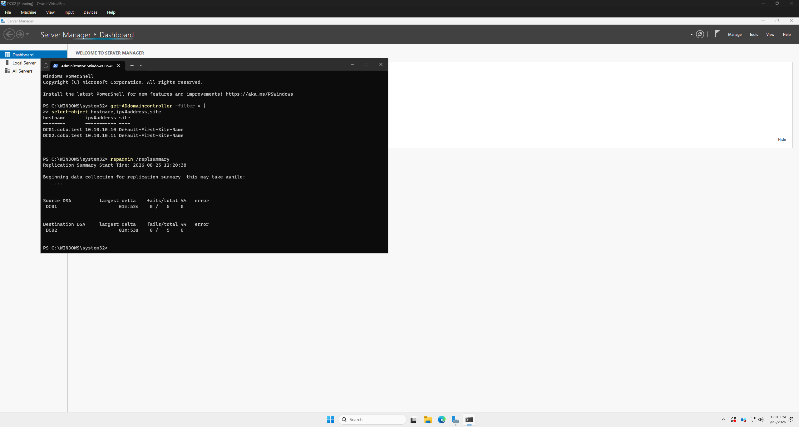

### Active Directory and DNS Verification

I queried DC02 directly to make sure replicated users, group memberships, and DNS records were available from the second server.

```powershell
Get-ADUser arivera -Server DC02.cobo.test -Properties Department
```

```powershell
Get-ADGroupMember GG_IT_Users -Server DC02.cobo.test
```

```powershell
Resolve-DnsName dc01.cobo.test -Server 10.10.10.11
```

I also checked the Active Directory service records and confirmed that `SYSVOL` and `NETLOGON` were available on DC02.

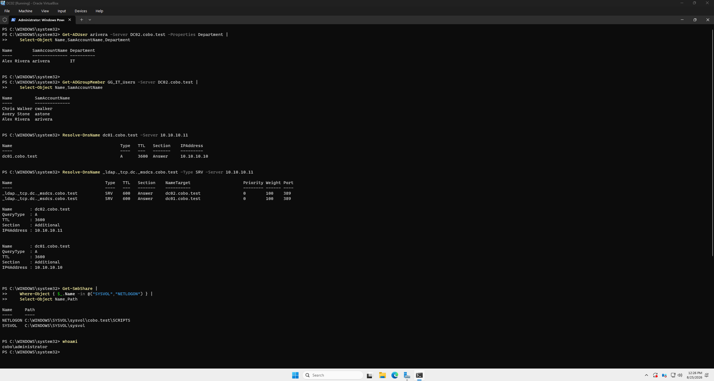

### Redundant DNS Configuration

Updated DHCP so clients receive both domain DNS servers:

- DC01: `10.10.10.10`
- DC02: `10.10.10.11`

After renewing CLIENT01, both DNS servers appeared in the client configuration.

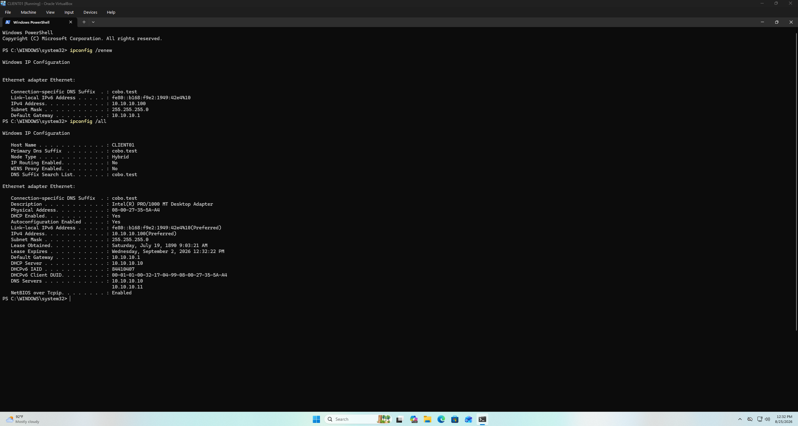

### Domain Controller Failover Test

I shut down DC01 to test whether CLIENT01 could use DC02 instead of just assuming the second server was ready.

On CLIENT01, I forced domain controller discovery with:

```powershell
nltest /dsgetdc:cobo.test /force
```

CLIENT01 located:

```text
DC: \\DC02.cobo.test
Address: \\10.10.10.11
```

I also checked the domain secure channel:

```powershell
nltest /sc_verify:cobo.test
```

The secure-channel check succeeded while DC01 was offline.

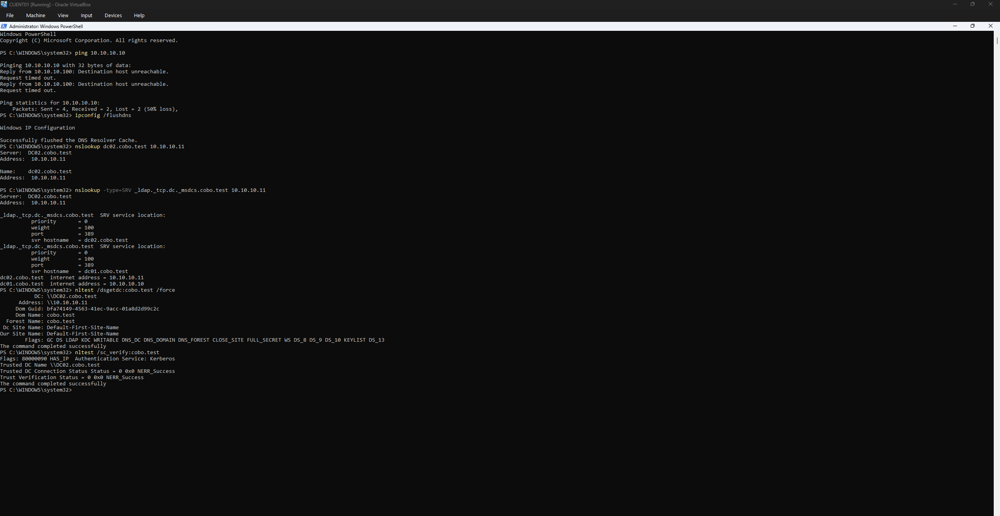

After the test, I brought DC01 back online and checked replication again.

### DHCP Failover Configuration

Once AD and DNS redundancy were working, I installed and authorized DHCP on DC02 and created a failover relationship with DC01.

I used the existing scope instead of building a second independent scope.

Failover settings:

- Relationship Name: `COBO-DHCP-Failover`
- Partner Server: `DC02.cobo.test`
- Mode: Load Balance
- Load Distribution: `50/50`
- Maximum Client Lead Time: `1 hour`
- Scope: `10.10.10.0/24`
- Address Pool: `10.10.10.100 - 10.10.10.200`

I checked the relationship from DC01:

```powershell
Get-DhcpServerv4Failover -ComputerName DC01 |
    Format-List Name,PartnerServer,Mode,State,LoadBalancePercent,MaxClientLeadTime
```

I also confirmed that DC02 had the replicated scope:

```powershell
Get-DhcpServerv4Scope -ComputerName DC02
```

The relationship was `Normal`, and DC02 showed the `10.10.10.0/24` client scope.

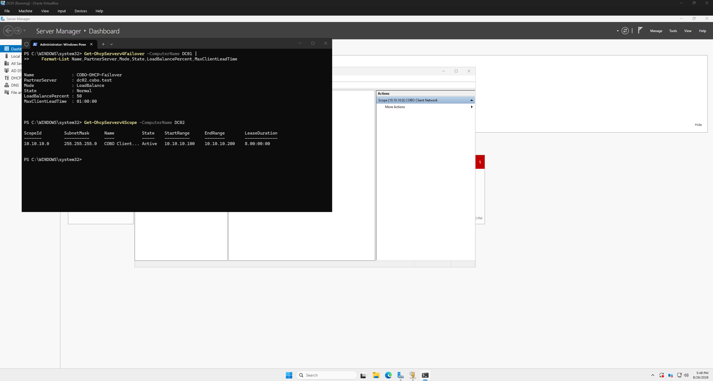

### DHCP Failover Testing

I shut down DC01 again and forced CLIENT01 to request a new DHCP lease.

```powershell
ipconfig /release
ipconfig /renew
ipconfig /all
```

With DC01 offline, CLIENT01 received its lease from:

```text
DHCP Server: 10.10.10.11
```

The client kept a valid address from the configured pool along with the correct gateway and DNS settings.

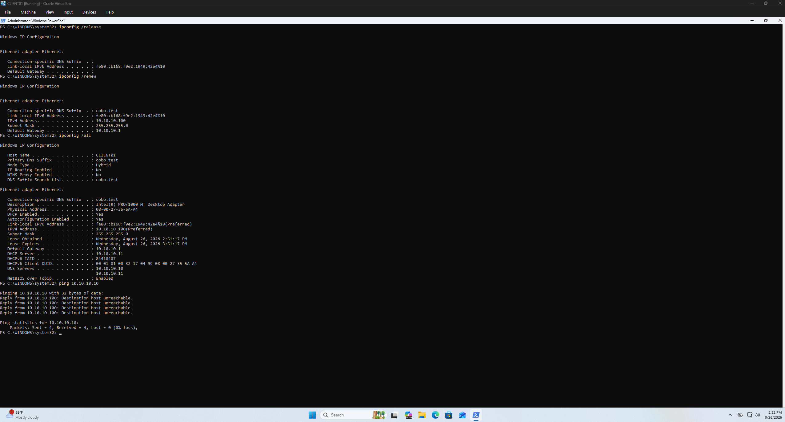

### Failover Recovery Verification

After bringing DC01 back online, I checked AD replication again:

```powershell
repadmin /replsummary
```

Replication returned with zero failures.

I then checked the DHCP relationship from both servers:

```powershell
Get-DhcpServerv4Failover -ComputerName DC01 |
    Format-List Name,PartnerServer,Mode,State,LoadBalancePercent
```

```powershell
Get-DhcpServerv4Failover -ComputerName DC02 |
    Format-List Name,PartnerServer,Mode,State,LoadBalancePercent
```

Both servers reported the relationship as `Normal`.

At this point, the lab had redundancy for:

- AD DS
- DNS
- DHCP

## PowerShell Automation

Built a PowerShell user-provisioning script that reads employee data from CSV and handles the account-creation process.

The script:

- Generates usernames
- Creates Active Directory accounts
- Sets department attributes
- Places users into department OUs
- Adds users to department security groups
- Requires a password change at first logon
- Skips existing accounts
- Handles provisioning errors
- Exports a results report

Source code:

[`New-COBOUsers.ps1`](scripts/New-COBOUsers.ps1)

Sample input:

[`new-users.csv`](data/new-users.csv)

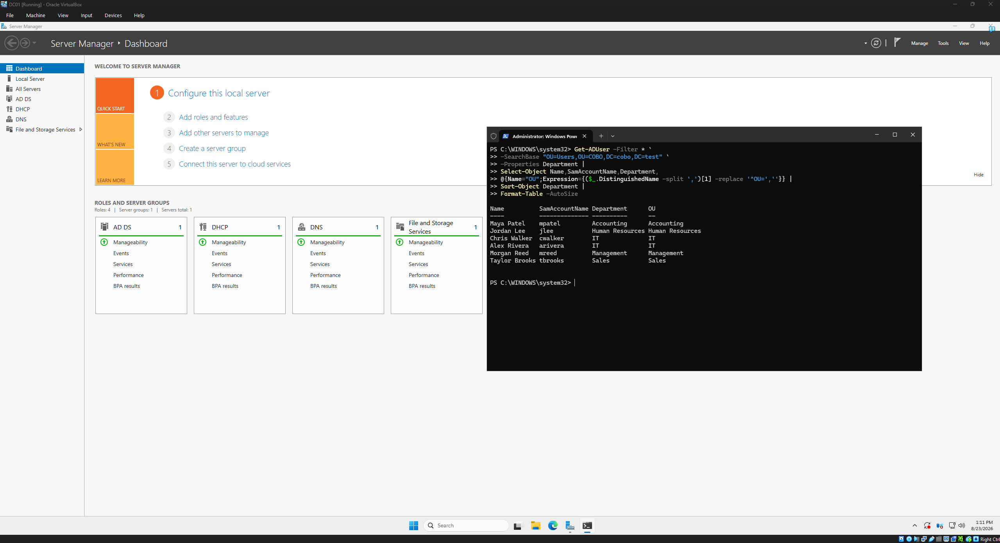

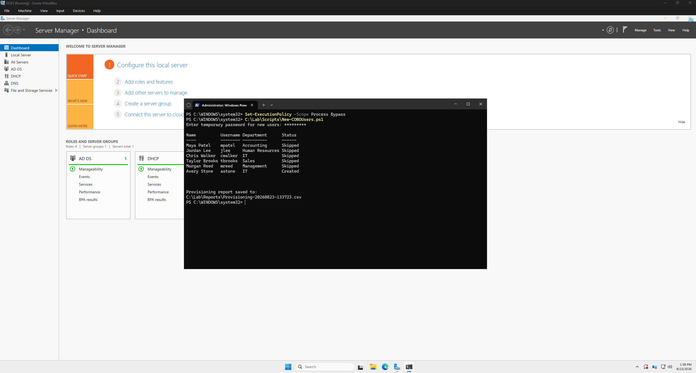

## DNS Configuration

Configured forward and reverse DNS resolution and created a PTR record for DC01.

Verified:

`dc01.cobo.test → 10.10.10.10`

and:

`10.10.10.10 → dc01.cobo.test`

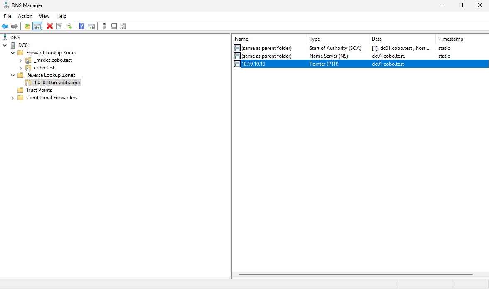

## Troubleshooting Scenarios

### Incorrect DNS Server

I intentionally changed CLIENT01 to use `8.8.8.8` instead of the internal DNS server.

**What I saw:**

- CLIENT01 still had a valid IP address.
- DC01 was reachable by IP.
- Internal domain names stopped resolving.
- Active Directory service discovery failed.

Because basic IP connectivity still worked, I focused on DNS instead of the network connection itself. CLIENT01 was using the wrong DNS server.

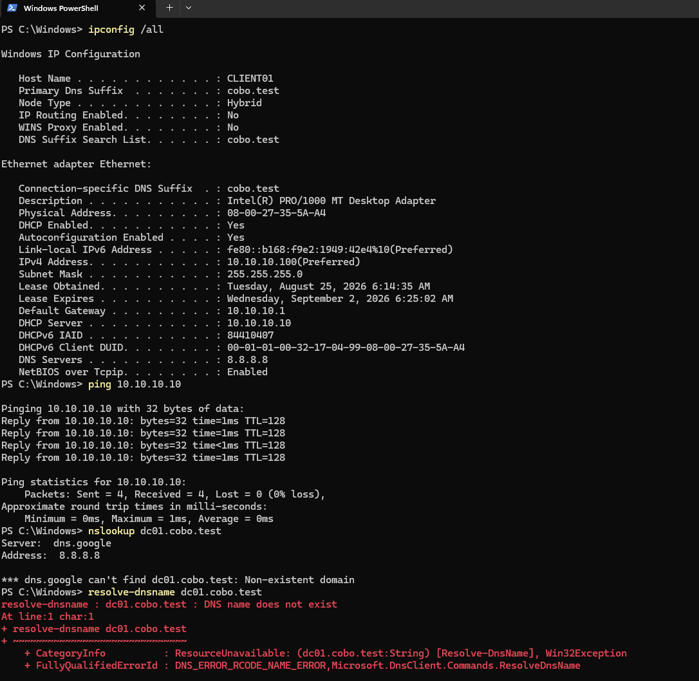

**Fix:**

Restored the DHCP-provided DNS settings, flushed the DNS cache, and checked hostname and SRV record resolution again.

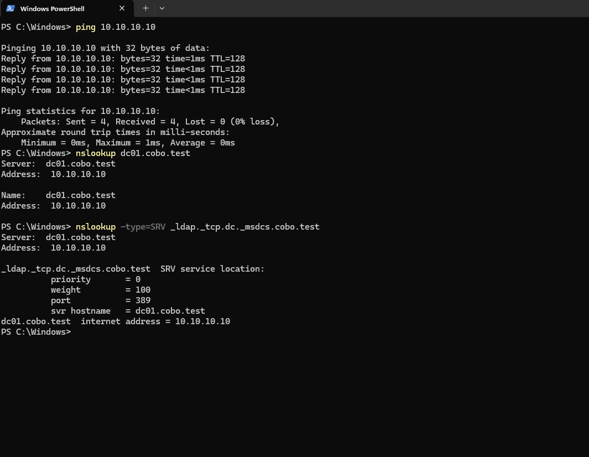

### Group Policy Not Applied

I moved CLIENT01 out of the `Workstations` OU and into the default `Computers` container.

**What I saw:**

- CLIENT01 stayed joined to the domain.
- Network and domain connectivity still worked.
- The workstation security GPO disappeared from `gpresult`.

The computer was healthy, but it was no longer inside the OU where the GPO was linked.

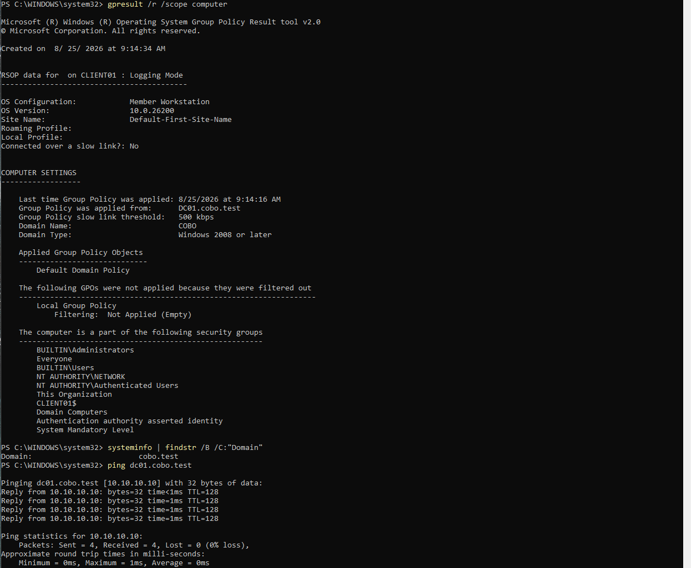

**Fix:**

Moved CLIENT01 back into the `Workstations` OU and refreshed Group Policy:

```powershell
gpupdate /force
```

`gpresult` showed the workstation policy again afterward.

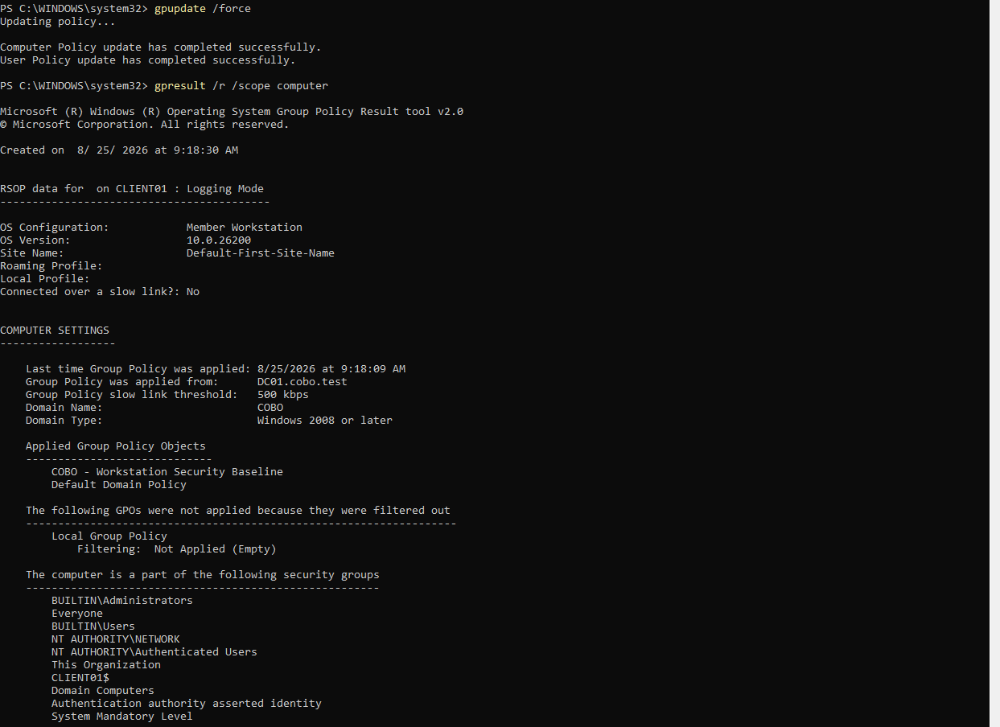

### File Share Access Denied

I removed `GG_IT_Users` from `DL_IT_Share_RW` to break access to the IT share.

After signing out and back in to refresh the user's security token, CLIENT01 could still connect to DC01 over TCP port 445, but `\\DC01\IT` returned `Access Denied`.

Since SMB connectivity worked, I focused on authorization rather than networking.

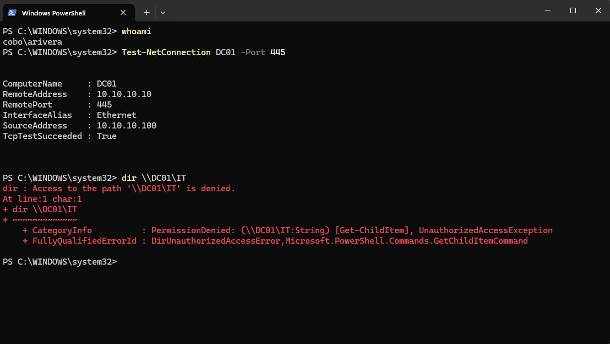

**Fix:**

Restored the AGDLP relationship:

```powershell
Add-ADGroupMember DL_IT_Share_RW -Members GG_IT_Users
```

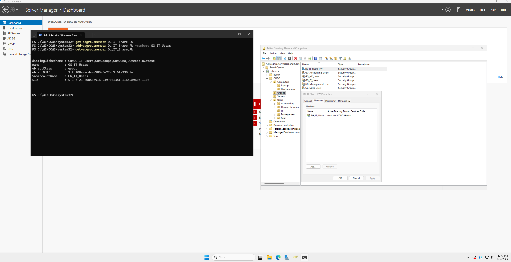

After another sign-out/sign-in, the user could access the share and create a test file.

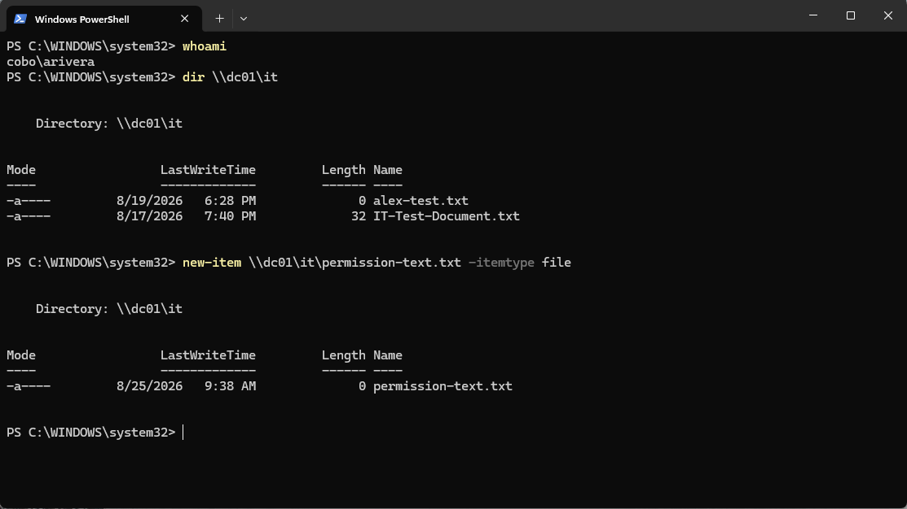

### Account Lockout and Recovery

Configured the domain lockout policy with:

- Account lockout threshold: `5` failed attempts
- Account lockout duration: `15 minutes`
- Reset account lockout counter after: `15 minutes`

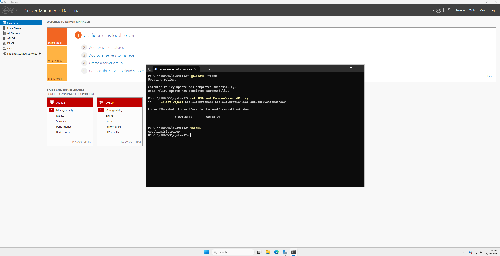

I entered an incorrect password repeatedly for `arivera` until the account locked, then checked the account from the domain controller:

```powershell
Get-ADUser arivera -Properties LockedOut
Search-ADAccount -LockedOut
```

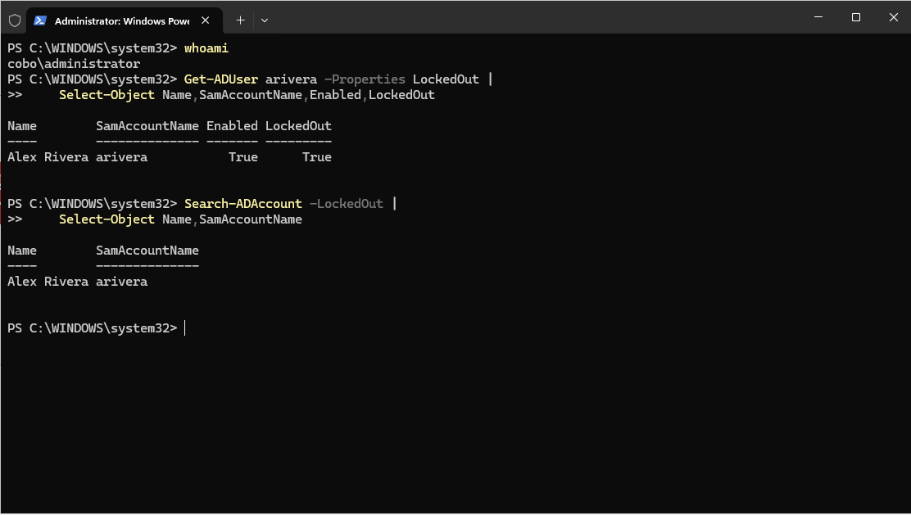

**Fix:**

Unlocked the account with:

```powershell
Unlock-ADAccount -Identity arivera
```

I checked the account again and confirmed that `LockedOut` returned `False`.

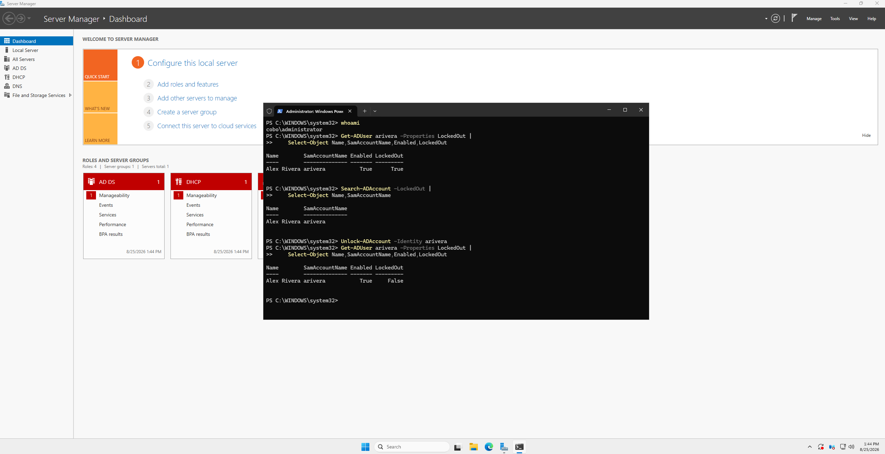

## Skills Demonstrated

- Windows Server administration
- Active Directory user and computer management
- OU design
- Active Directory replication
- Domain controller failover and recovery testing
- DNS administration, redundancy, and troubleshooting
- DHCP administration and load-balanced failover
- Group Policy deployment and scope troubleshooting
- PowerShell and CSV-based user provisioning
- Security-group management and AGDLP permissions
- SMB file sharing
- NTFS permission troubleshooting
- Account lockout policy configuration and recovery
- Domain workstation administration
- Windows networking and service troubleshooting
- GitHub documentation
